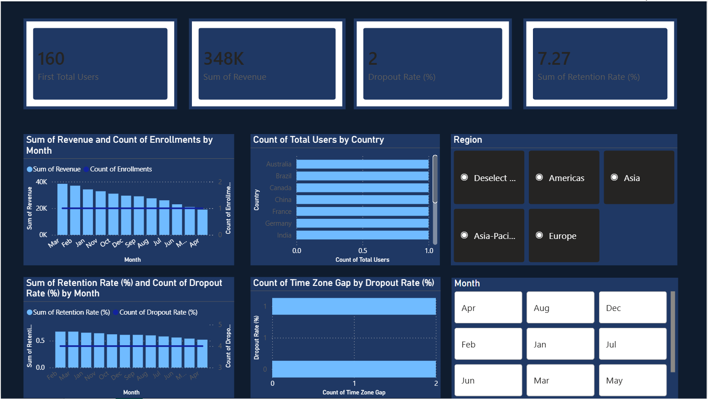

# 🎹 Piano Platform Analytics Dashboard


> 🌍 **Real-time client project** — End-to-end analytics dashboard for a global online piano learning platform operating across 10+ countries with 5,000+ users.

---

## 📸 Dashboard Preview



---

## 📌 Project Overview

| | |
|---|---|
| 🏷️ **Type** | Real-Time Client Project |
| 🎓 **Domain** | EdTech / Online Learning |
| 🛠️ **Tools** | Power BI, Python (Pandas), Excel, Power Query |
| 📊 **Dataset** | 5,000+ user records across 10+ countries |
| 📅 **Timeline** | 2025 – 2026 |

This project involved owning the **complete analytics lifecycle** — from raw data ingestion and cleaning to KPI dashboard delivery — for a live global client. The platform offers online piano lessons and was experiencing high student dropout rates with no clear visibility into why.

---

## ❓ Problem Statement

The client had no centralized view of:
- 📉 Where revenue was growing or declining month-over-month
- 🌏 Which countries had the highest enrollment and lowest retention
- 🚪 Why students were dropping out at high rates
- ✅ What operational change could improve retention

---

## 🔍 Approach

### 1️⃣ Data Cleaning & Preparation
- Resolved **3 critical data quality issues**: inconsistent country codes, name formatting errors, and date format mismatches
- Used **Python (Pandas)** and **Power Query** to standardize 5,000+ records
- Reduced data errors by **~40%** before analysis began

### 2️⃣ Exploratory Analysis
- Analyzed monthly revenue trends, enrollment patterns, and dropout signals
- Segmented users by country, region, and time zone gap from instructor
- Identified peak enrollment windows and low-retention periods

### 3️⃣ Key Insight Discovered
> 💡 **Time zone misalignment between students and instructors was the #1 dropout driver.**
> Students with a 6–8 hour gap had a **51% dropout rate**. Those with 9+ hours had **74%**.

### 4️⃣ Dashboard Development
Built an interactive **Power BI dashboard** with:
- 📦 4 KPI cards (Revenue, Users, Retention Rate, Dropout Rate)
- 📈 Monthly revenue & enrollment combo chart
- 📉 Retention vs dropout trend line chart
- 🌍 Country-wise enrollment bar chart
- ⏰ Dropout rate by time zone gap analysis
- 🔘 Region and Month slicers for dynamic filtering

---

## 🏆 Key Results

| Metric | Value |
|---|---|
| 👥 Total Users Analysed | 5,000+ |
| 🌍 Countries Covered | 10+ |
| 🧹 Data Error Reduction | ~40% after cleaning |
| 💰 Revenue Growth (12 months) | $19,000 → $38,400 |
| 📈 Projected Retention Improvement | ~30% with scheduling fix |
| ⚠️ Dropout Rate (9h+ TZ gap) | 74% — critical risk identified |

---

## ✨ Dashboard Features

```
📦 KPI Cards       → Total Users · Monthly Revenue · Retention Rate · Dropout Rate
📈 Trend Chart     → 12-month Revenue & Enrollment (combo bar + line)
📉 Retention Chart → Retained vs Dropped-out % over time
🌍 Country Chart   → User enrollment breakdown by country
⏰ Dropout Analysis → Dropout rate segmented by time zone gap
🔘 Slicers         → Filter by Region · Filter by Month
```

---

## 📁 Files in This Repo

```
├── 📊 Piano_Platform_Dashboard_v2.xlsx   # Clean data source (4 sheets, Power BI ready)
├── 🖼️ dashboard_preview.png              # Final dashboard screenshot
└── 📄 README.md                          # Project documentation
```

### 📋 Excel Sheet Structure
| Sheet | Contents |
|---|---|
| 📅 Monthly Data | 12-month revenue, enrollments, retention & dropout rates |
| 🌍 Country Data | 13 countries with region, user count & % share |
| ⏰ Dropout Analysis | Time zone gap vs dropout rate + key insight |
| 📌 KPI Summary | All 9 headline metrics in one table |

---

## 🚀 How to Use

1. 📥 Download `Piano_Platform_Dashboard_v2.xlsx`
2. 🖥️ Open **Power BI Desktop** → Get Data → Excel
3. ✅ Load all 4 sheets
4. 🎨 Build visuals using the field mapping below

### 🗺️ Recommended Field Mapping
| Visual | X-axis / Category | Y-axis / Values |
|---|---|---|
| 📊 Combo Chart | Month | Revenue (bar), Enrollments (line) |
| 📈 Line Chart | Month | Retention Rate, Dropout Rate |
| 📊 Bar Chart | Country | Total Users |
| 📊 Bar Chart | Time Zone Gap | Dropout Rate |
| 🔢 KPI Card | — | Sum of Revenue |
| 🔢 KPI Card | — | Average of Retention Rate |

---

## 🛠️ Tools & Technologies

| Tool | Purpose |
|---|---|
| 🐍 **Python (Pandas)** | Data cleaning, EDA, error resolution |
| ⚡ **Power Query** | Data transformation in Excel & Power BI |
| 📊 **Power BI** | Dashboard development, DAX measures, slicers |
| 📗 **Excel** | Structured data storage, chart prototyping |

---

## 💼 Skills Demonstrated

`📊 Data Cleaning` `🔍 Exploratory Data Analysis` `📈 Power BI` `🎨 Dashboard Development`
`📌 KPI Reporting` `⚡ DAX` `🔄 Power Query` `🐍 Python` `🧠 Business Intelligence`
`👥 Stakeholder Reporting` `🔎 Root Cause Analysis` `📉 Data Visualization`

---

## 👩‍💻 About

**Sri Lakshmi Harshitha Nandivada**
📊 Data Analyst | 🎓 MBA Finance candidate | 📍 Hyderabad | ✈️ Open to Relocation

[](https://linkedin.com/in/harshitha-nandivada)
[](https://github.com/HarshiDataWorld)

---

⭐ *If you found this project useful, consider giving it a star!*

*🗂️ Part of a portfolio of real-world data analytics projects.*
*See also: [🔄 Customer Churn Analysis](https://github.com/HarshiDataWorld/Bank-Customers-Churn-Analysis) · [🎬 Netflix Dashboard](https://github.com/HarshiDataWorld/NetFlix-Dashboard)*
